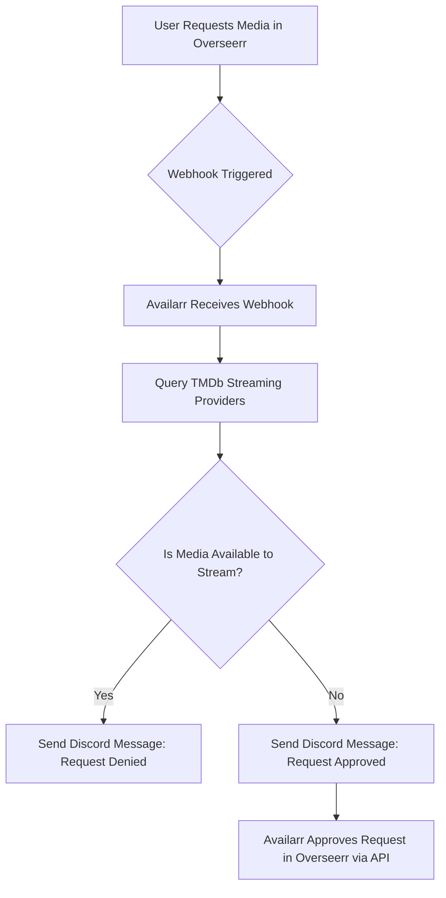

# 🤖 Availarr: The Ultimate Streaming Request Gatekeeper

Availarr is a webhook-based automation service that checks whether requested media (movies or TV shows) are available on select streaming services **before** allowing the request in Overseerr. If it's already available to stream, the request is denied and a message is sent to Discord. If it's not available, the request is **automatically approved**.

> ⚠️ **IMPORTANT**: You MUST disable "Auto Approve" in Overseerr. If you don't, Availarr will NOT work properly.

---

## ✨ Features

* ✅ Checks media availability on TMDb (backed by Prime, Netflix, Apple TV+, Discovery+, Paramount+)
* 🚀 Webhook-based — plug directly into Overseerr
* 🚨 Sends Discord alerts on rejections or approvals
* 🌐 Live web interface for entering API keys and selecting provider settings
* 🔗 Easy Docker deployment — no need for `.env` or volumes

---

## 🚧 Deployment Instructions

### 1. 🚀 Prerequisites

You'll need the following:

* ✨ **TMDb API Key**
  [Get one here](https://www.themoviedb.org/settings/api)

* ⚖️ **Overseerr API Key**
  Found in Overseerr settings under "API"

* 🧡 **Discord Webhook URL**
  From Discord > Edit Channel > Integrations > Webhooks

* ⚠️ **Overseerr Auto-Approve MUST BE DISABLED**

---

### 2. 🏢 Docker Deployment

Your up-to-date `docker-compose.yml` should look like:

```yaml
version: '3.8'

services:
  availarr:
    container_name: availarr
    image: ematts/availarr:latest

    ports:
      - "8686:8686"
    restart: unless-stopped

    environment:
      - TZ=America/Chicago

    volumes:
      - availarr_config:/config

    logging:
      driver: json-file
      options:
        max-size: "10m"
        max-file: "3"

volumes:
  availarr_config:

```

Then deploy:

```bash
docker-compose pull
docker-compose up -d
```

---

### 3. 🚩 Open the Web Interface

Navigate to: [http://localhost:8686](http://localhost:8686)

There is no login required. On the first visit, you will be prompted to enter:

* ✅ Your TMDb API Key
* ✅ Your Overseerr URL and API Key
* ✅ Your Discord Webhook URL
* ✅ The streaming providers you subscribe to (e.g. Netflix, Prime Video, etc.)

> ⚠️ You must press the **Save** button after entering your settings.

---

### 4. 🎭 Overseerr Webhook Setup

In Overseerr:

1. Go to **Settings > Webhooks > Add Webhook**
2. Check the box for **Enable Agent**
3. Set the Webhook URL: `http://<your-availarr-server-ip>:8686/webhook`
4. Check the following boxes:

   * ✅ Request Pending Approval
   * ✅ Request Automatically Approved
   * ✅ Request Available
5. Click **Save**

> ⚠️ Again: Be sure **Auto-Approve is DISABLED** in Overseerr!

---

## 🔄 Request Processing Flow



---

## 📊 Logging and Monitoring

* Logs output to stdout and Docker logs
* Structured logging via `logging.json`

---

## ✨ Contributing

Pull requests welcome! Roadmap includes:

* Dark mode toggle
* Real-time health panel
* Watchtower auto-update integration

---

## 🚩 Final Notes

> ⚠️ **If you do not disable Overseerr Auto-Approve**, this app **will not function properly**.

Availarr was built to give control back to media server admins and avoid wasting downloads on content already available to your users. Keep it lean, smart, and Discord-notified.

---

## ⚙️ Maintained By

**@emattsJ**
Docker Hub: [https://hub.docker.com/r/ematts/availarr](https://hub.docker.com/r/ematts/availarr)
